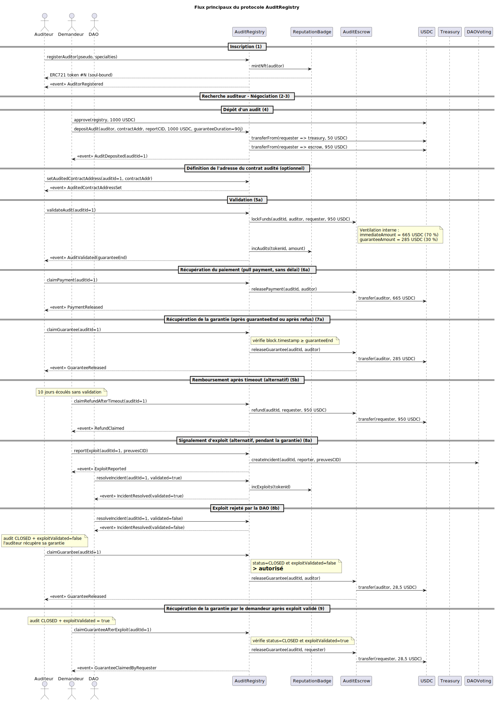

# AuditRegistry – Backend

Contrats Solidity et tests du protocole AuditRegistry.

## Contrats

| Contrat | Responsabilité |
|---|---|
| `AuditRegistry.sol` | Contrat principal : inscriptions, dépôts, validations, gestion des exploits |
| `AuditEscrow.sol` | Séquestre des fonds USDC, pull payment (paiement 70 % + garantie 30 %) |
| `ReputationBadge.sol` | NFT ERC-721 soul-bound (EIP-5192) – score de réputation des auditeurs |
| `mocks/MockUSDC.sol` | Token ERC-20 mintable pour les tests |
| `mocks/MockTreasury.sol` | Réceptacle des frais de protocole (5 %) |
| `mocks/MockDAOVoting.sol` | DAO simplifiée pour la résolution des incidents |

## Diagrammes



- [Flux de séquence – source PlantUML](../docs/sequence.puml)
- [Cas d'utilisation – source PlantUML](../docs/usecases.puml)

## Lancer les tests

```bash
npm install
npx hardhat test
```

## Déploiement local

**Terminal 1 – nœud Hardhat :**
```bash
npx hardhat node
```

**Terminal 2 – déploiement + seed :**
```bash
npx hardhat run scripts/deployAllAndSeed.ts --network localhost
```

Le script déploie tous les contrats, inscrit 4 auditeurs de test, dépose et valide un audit, et met à jour automatiquement `frontend/.env` avec les adresses et le bloc de départ.

## Déploiement sur Sepolia

**Prérequis :** enregistrer les secrets dans le keystore Hardhat :

```bash
npx hardhat keystore set SEPOLIA_RPC_URL
npx hardhat keystore set SEPOLIA_PRIVATE_KEY
```

Copier `.env.example` vers `.env` et renseigner les clés privées des comptes de test (doivent avoir de l'ETH Sepolia).

```bash
cp .env.example .env
npx hardhat run scripts/deployAllAndSeed.ts --network sepolia
```

## Stack

Hardhat 3 · Solidity 0.8.28 · TypeScript · Viem · `node:test`
